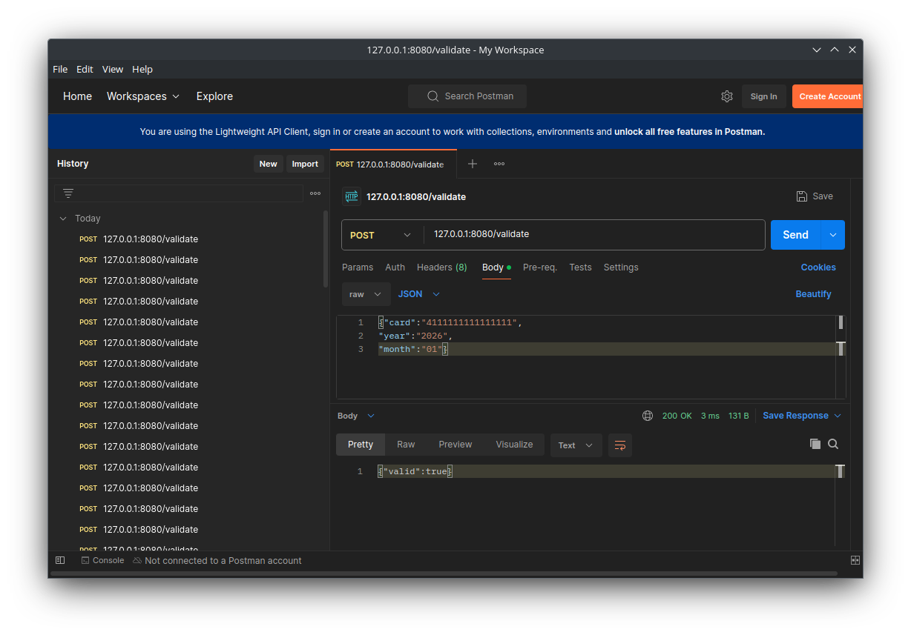
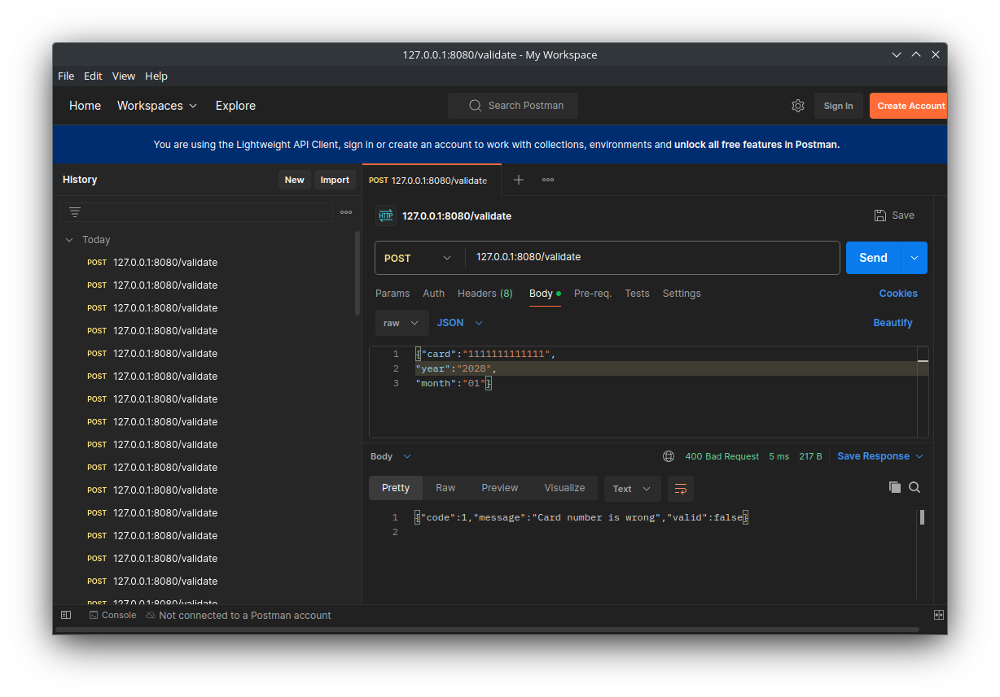

# Api Service for cards validation

## Response structure

```
valid: true/false
error optional: 
   - code: 001
   - message: some message
```
## Used error codes

1 - Provided year and month expired

2 - Bad json

3 - Wrong card number

## Also

Despite Post query is used, it is still http, so this service is not recommended for real use, at least without tls

# Examples


